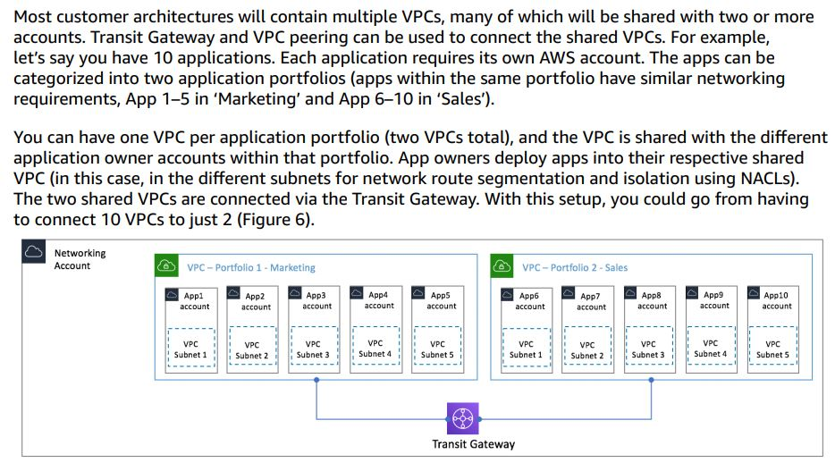

# aws-vpc-shared
AWS VPC Architecture best practices for a complete "shared" VPC. The intention here is to reduce the amount of VPC's an organisation has and instead provide application teams in different accounts with access to Subnets for their deployments. You don't have to completely avoid multiple VPC's, additional VPC's can still be configured to communicate with a shared VPC using VPC peering or Transit gateway.

- Useful when network isolation between teams doesn't need to be as strictly enforced but you still want to control who can create what and in which subnets by enforcing permissions against accounts.

- In this model, you essentially share one or more subnets with an account (probably an application team). This account can only deploy resources in this subnet. 

- Network security is handled with network ACL's and security groups

- One subnet per participant account enables network ACL to provide network isolation in addition to security groups.

- Overall control and visibility of all of the VPC and subnets is retained by the Networking team account, this account is responsible for handing out the subnets to the other participant app team accounts. 

## Example from AWS Whitepaper on VPC architecture
  
  
